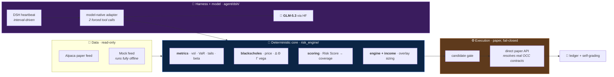
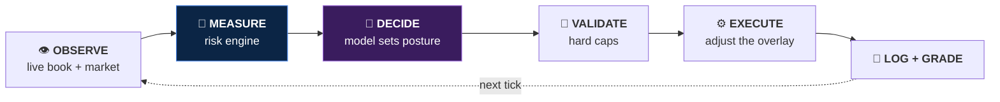
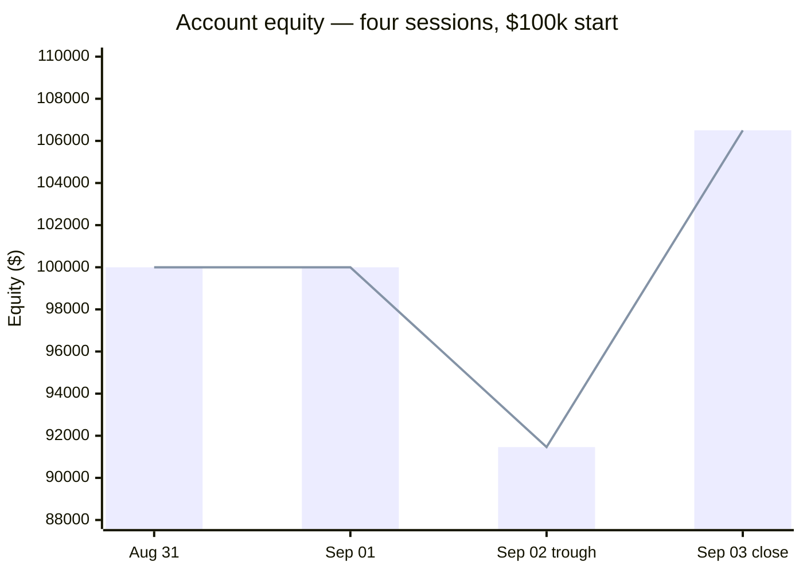
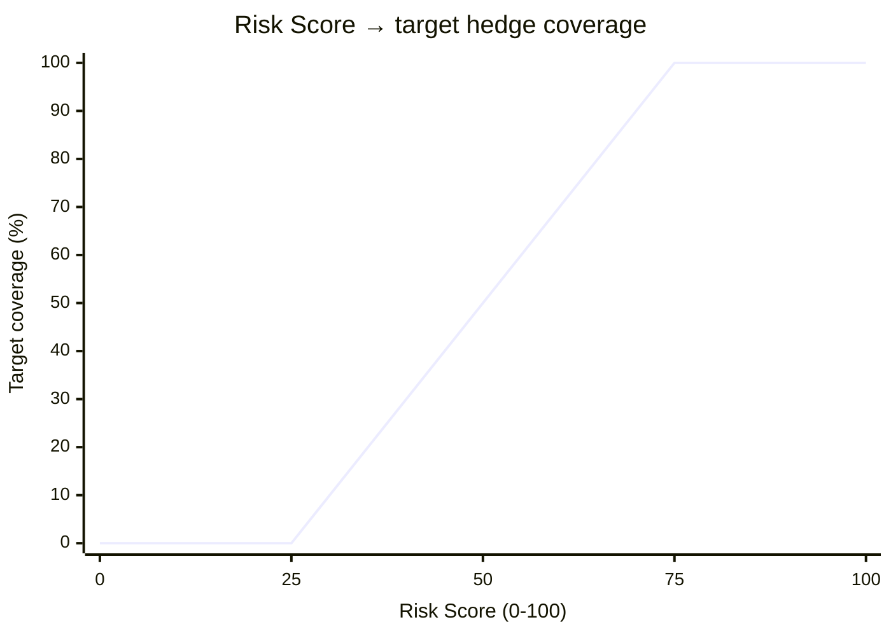
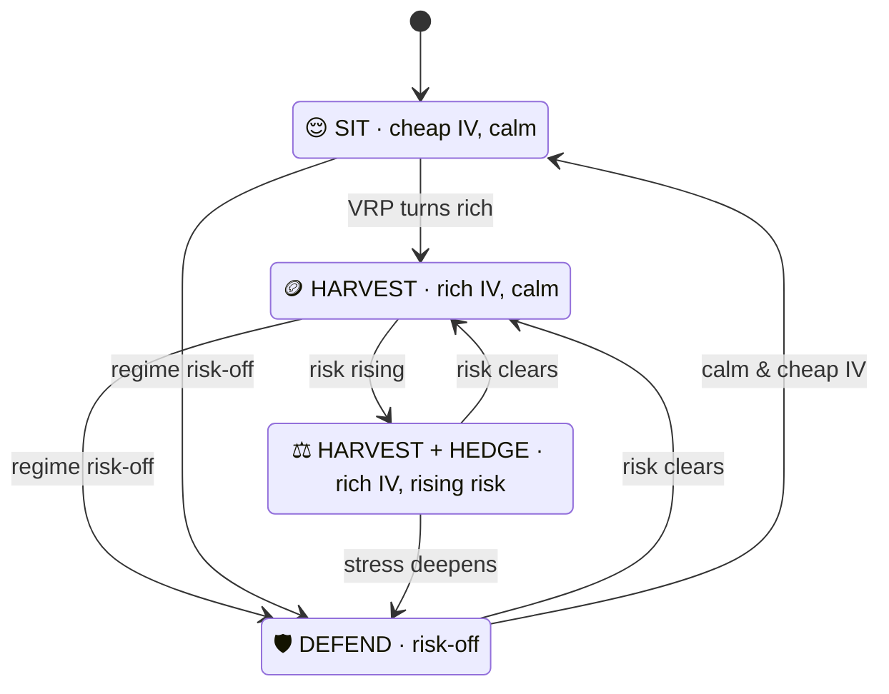

<div align="center">

# 🛡️ Liquidity Leak

### An autonomous agent that holds a real long equity book and **defends it with options** — like a risk manager, not a gambler.

<sub>Team **Liquidity Leak** · Alpaca × lablab.ai Hackathon · *Options Alpha Agents*</sub>


</div>

---

> **It never predicts direction.** It measures risk deterministically, lets a model judge
> posture, enforces every cap in code, and writes down *why*. A bad day cannot hurt the
> book, and it collects premium while it waits.

---

## The idea

Most "AI trading" bots predict direction and bet on it — a coin flip in a nice costume.
And naïve hedging *loses*: protection costs premium, so in a calm week an insurance bot
just bleeds. We treat options as a **risk overlay, not a wager**, on top of an appreciating
core book of liquid ETFs and mega-caps.

- **Core book** — liquid ETFs and mega-caps, held long. The agent *protects* the book; it never picks it.
- **Options overlay** — protective puts, collars, put spreads, defined-risk iron condors, covered calls.
- **Deterministic gate** — sizes every leg, enforces every cap, rejects what it cannot validate. The model never picks a strike, expiry, or contract count.

## Architecture



One full cycle per heartbeat tick — 30 min default, market hours only:



| Deterministic Python owns | The model owns |
| --- | --- |
| Exposure, volatility, VaR, stress tests | Whether risk is worth hedging right now |
| Contracts needed for a target coverage | How much to protect, given cost and regime |
| Whether protection is cheap today | When to release a hedge no longer needed |
| All order sizing and hard risk caps | Reading context the numbers miss, and explaining it |

**The model never does arithmetic and never invents an order.** It picks exactly one of a
set of pre-vetted, pre-sized candidates.

---

## Results — Alpaca paper account, four sessions



| | |
| --- | --- |
| Starting equity | $100,000 |
| Ending equity | **$106,501.58** |
| Net return | **+6.5%** |
| Total profit | $6,501.58 |
| Trough | $91,461 (−7.2%, Sep 02) |
| Fills / orders sent | 32 / 49 |
| Equities in the core book | 8 |
| Listed OCC contracts traded | 8 |

The curve was flat near $100k while the stack was being wired up, drew down to $91,461 on
Sep 02, then recovered to $106,501.58 as the overlay paid and positions were flattened on
Sep 03. *(The two flat sessions are marked at ~$100k; the trough and close are exact.)*

### What it traded

**Core book — 8 equities held long**

| Symbol | Role |
| --- | --- |
| SPY | Broad-market core (500 names) — also the hedge underlying |
| QQQ | Tech / growth tilt (100 names) |
| IWM | Small-cap breadth (2000 names) |
| DIA | Large-cap value / industrials (30 names) |
| AAPL · MSFT | Mega-cap singles — the "real stocks" sleeve |
| DELL · MDB | Single-name sleeve, covered-call eligible |

Weights — not hard-coded share counts — are the single source of truth, so the same
definition sizes correctly at any account value or price
(see [`risk_engine/book.py`](risk_engine/book.py)).

**Options overlay — 8 listed OCC contracts**

Every leg resolved to a real listed OCC contract; nothing synthetic, nothing simulated.
Structures traded across the window:

| Structure | Purpose | Risk shape |
| --- | --- | --- |
| Protective put (SPY) | Coverage steps in as the Risk Score rises | Defined — premium paid |
| Collar | Finances the put with a short call | Defined both sides |
| Put spread | Cheaper partial coverage | Defined |
| Iron condor (SPY) | Range-bound premium harvest, 4-leg `mleg` | Defined both sides |
| Covered call | Income on an approved held name | Capped upside, no new downside |

One index call — `SPY260901C00765000`, 100 contracts — went to house auto-liquidation at
expiry. It is on the tape and in the ledger.

> Four sessions is a sample, not evidence. Every position in the window was defined-risk,
> with the worst case known before the order was sent.

---

## Risk engine (`risk_engine/`)

Pure Python, no runtime dependencies, runs offline against a mock feed.

| Group | Measures |
| --- | --- |
| **Exposure** | delta · gamma · theta · vega · beta-weighted delta · downside semi-beta · concentration by name |
| **Turbulence** | EWMA volatility (λ = 0.94) · drawdown from peak · regime vs the 50-day · realized vs implied |
| **Tail** | 1-day VaR at 95/99 · Cornish–Fisher fat-tail adjustment · expected shortfall · stress P&L hedged vs unhedged |
| **Premium richness** | expected move from IV · IV rank · put skew · variance risk premium · coverage and cost drag |

### Risk Score → coverage (`risk_engine/scoring.py`)

Weighted composite, 0–100:

| Signal | Weight | Normalization anchor |
| --- | --- | --- |
| Drawdown from peak | 0.30 | 10% drawdown |
| EWMA volatility | 0.30 | 10–40% vol band |
| Regime vs 50-day | 0.20 | — |
| Value at Risk | 0.20 | 3% of equity |



Calm ⇒ unhedged, zero drag. Stress ⇒ protection steps up in proportion, not in a panic.
Income posture is gated on variance risk premium (0–8 vol points) and damped by regime, so
the agent is **never short premium into a risk-off tape**. The two dials combine into one
of four stances each cycle:



---

## Hard limits

Enforced in code, *after* the model decides. The model cannot argue with them.

| Guardrail | Cap | Behaviour when breached | Source |
| --- | --- | --- | --- |
| Defined risk | ≤ **10%** of equity | Reject the decision | `agent/limits.py` |
| Hedge-cost drag | ≤ **5%** | Reject the decision | `agent/limits.py` |
| Short premium | disallowed at risk score ≥ **40** | Reject the decision | `agent/gate.py` |
| Written reason | mandatory, ≤ 1000 chars | Reject the decision | `agent/limits.py` |
| Candidates per decision | exactly **1**, from the admissible set | Reject the decision | `agent/gate.py` |
| Daily-loss halt | −5% on the day | Stop opening new premium, keep the hedge | `risk_engine/limits.py` |
| Total option risk | ≤ 30% of equity | Scale income down to fit | `risk_engine/limits.py` |
| Per-underlying risk | ≤ 15% of equity | Scale the offending symbol down | `risk_engine/limits.py` |

Offending income is **scaled down, never silently dropped** — the model only ever chooses
from a pre-validated set. Fail-closed reject list: `stale_or_unknown_context`,
`candidate_not_admissible`, `reason_required`, `defined_risk_limit_exceeded`,
`hedge_cost_limit_exceeded`, `coverage_out_of_bounds`,
`short_premium_disallowed_in_elevated_risk`.

---

## Runtime — DSH harness

Registered as one DSH profile, `portfolio-agent`.

```bash
dsh plugin --profile portfolio-agent add .
dsh --profile portfolio-agent --live --heartbeat --place
```

`--live` real paper account · `--interval` cadence in ms · `--place` off by default (dry run otherwise)

| Plugin | Role |
| --- | --- |
| `alpaca-readonly.js` | Starts the official Alpaca MCP server as a stdio child; five allowlisted read tools (account, positions, bars, latest trade, option chain). Account and user ids stripped recursively, result size bounded, fails closed with no credentials. |
| `alpaca-orders.js` | Resolves each leg to a real listed OCC contract; condors submit as a four-leg `mleg` order. Placement is server-side, never by the model. |
| `heartbeat.js` | DSH-native loop; wakes on an interval during market hours, one decide cycle per tick. Replaced the scheduled cron entirely. |
| **replay adapter** | Drives calm / elevated / stressed scenarios end to end with no token, no keys, no account. Temporary profile and dry-run ledger per run. |

### Order placement: MCP → direct

**v1** placed every order through the Alpaca MCP server. It worked — real contracts, real
fills — but each order was a stdio round-trip through a child process, and when the tape
moved fast that latency showed up as slippage.

**v2** moved placement in-process: the agent runtime holds the account credentials and hits
the paper API directly, inside the same cycle that made the decision.

The gate did not change between versions. It still sizes every leg and enforces every cap
before anything is submitted. Before an autonomous write the executor re-resolves the listed
contracts, derives the worst executable bid/ask price, rechecks the hedge-cost or condor
defined-risk cap, and sends a bounded limit (or signed net-credit multi-leg limit) order.
Missing quotes or a breached cap stop the cycle without an order.

---

## Model selection

**GLM-5.3**, served via Hugging Face Inference Providers. Chosen on a **30-call transport
qualification** per candidate (10 direct + 20 through the DSH harness) with a strict, forced
two-tool schema. Evidence committed as [`results/`](results/).


| Candidate | Verdict | Direct (10) | DSH (20) | Schema-invalid D/DSH | Timeouts |
| --- | --- | --- | --- | --- | --- |
| **GLM-5.3** | ✅ Passed | 10/10 | 20/20 | 0 / 0 | 0 |
| DSV4-Pro | ❌ Failed | 0/10 | 18/20 | 10 / 2 | 0 |
| DSV4-Flash | ❌ Failed | 9/10 | 16/20 | 1 / 4 | 0 |

Only GLM-5.3 was transport-stable across all 30 calls. Both DeepSeek candidates failed on
native DSML **schema instability** — not parse errors, not timeouts. That is the failure
mode that matters here: an inadmissible tool call cannot trade, the gate rejects it, and the
cycle is wasted. The model-native adapter normalizes each provider's dialect (standard
tool-calls, GLM XML, DeepSeek DSML) back to one canonical call — no prompt demonstrations,
temperature 0, harness-owned decision ids.

Protocol lives in `scripts/`, `agent/model_evaluation.py`, `tests/`.

---

## Repository map

```
risk_engine/   Pure-Python options + portfolio math — the deterministic core
               metrics · blackscholes · scoring · engine · income · limits · book
agent/         Reasoning layer — candidates · gate · cli · model_evaluation
  dsh/         DSH harness · model-native adapter · heartbeat · paper executor (Node)
feed/          Data sources — Alpaca (live) + mock (offline), one interface
harness/       Order translation + paper executor (fail-closed)
runtime/       Self-grading + the strategy API
backtest/      Historical crash replay — hedged vs. unhedged equity curves
deploy/        Modal always-on heartbeat + model-eval apps
results/       Committed model-qualification evidence
tests/         74 Python tests · agent/dsh/tests 20 Node tests
```

## Run it

```bash
# Seed the core book on the Alpaca paper account (dry-run first)
python scripts/seed_book.py            # show the plan
python scripts/seed_book.py --execute  # place the paper buy orders

# Take one live decision cycle
python -m agent.cli context --live
```

Credentials come from `.env` (`ALPACA_API_KEY` / `ALPACA_SECRET_KEY`, paper only). **The
whole stack runs offline against a mock feed when no keys are set** — no account needed to
develop.

## Testing

```bash
python -m unittest discover -s tests   # 74 Python tests
cd agent/dsh && npm test               # 20 DSH / adapter tests
```

**94 tests, zero external services required.** Metrics, pricing, scoring, sizing, caps, the
candidate gate, the model-native adapter, and the paper-placement path — all offline.

## Roadmap

- Replay the engine through COVID 2020, the 2022 bear, and the 2024 vol spike — hedged vs. unhedged
- Domain finetuning on finance tool-use
- Always-on event-driven runtime

---

<div align="center">

**Team Liquidity Leak** · built for the Alpaca × lablab.ai Hackathon
Numbers measure. The model judges. The log remembers.

<sub>MIT licensed · paper-trading only · not investment advice</sub>

</div>
