<div align="center">

# 🛡️ Liquidity Leak

### An autonomous AI agent that holds a real book of stocks and **defends it with options** — like a risk manager, not a gambler.

<sub>Team **Liquidity Leak** · Alpaca × lablab.ai Hackathon · *Options Alpha Agents*</sub>


</div>

---

> **It never guesses which way the market will go.** It measures risk with hard math,
> decides posture with a reasoning model, steps a hedge in and out as conditions change,
> writes down *why* — then grades itself. A bad day can't hurt the book, and it quietly
> collects premium while it waits.

---

## 📖 Table of contents

- [The idea](#-the-idea)
- [System architecture](#-system-architecture)
- [The decision loop](#-the-decision-loop)
- [Per-cycle protocol](#-per-cycle-protocol-model--deterministic-core)
- [What it measures](#-what-it-measures)
- [Strategy postures](#-strategy-postures)
- [How the hedge reshapes P&L](#-how-the-hedge-reshapes-pl)
- [The core book](#-the-core-book)
- [Hard risk caps](#-hard-risk-caps-the-model-cannot-override-these)
- [Model selection & qualification](#-model-selection--qualification)
- [Deployment](#-deployment-always-on-heartbeat)
- [Repository map](#-repository-map)
- [Run it](#-run-it)
- [Testing](#-testing)
- [Roadmap](#-roadmap)

---

## 💡 The idea

Most "AI trading" bots predict direction and bet on it — a coin flip in a nice costume.
And naïve hedging *loses* money: protection costs premium, so in a calm week an insurance
bot just bleeds. **We solve both** by treating options as a risk overlay, not a wager, on
top of an appreciating core book of liquid ETFs + mega-caps.

Three engines drive the P&L, each with its downside capped by design:

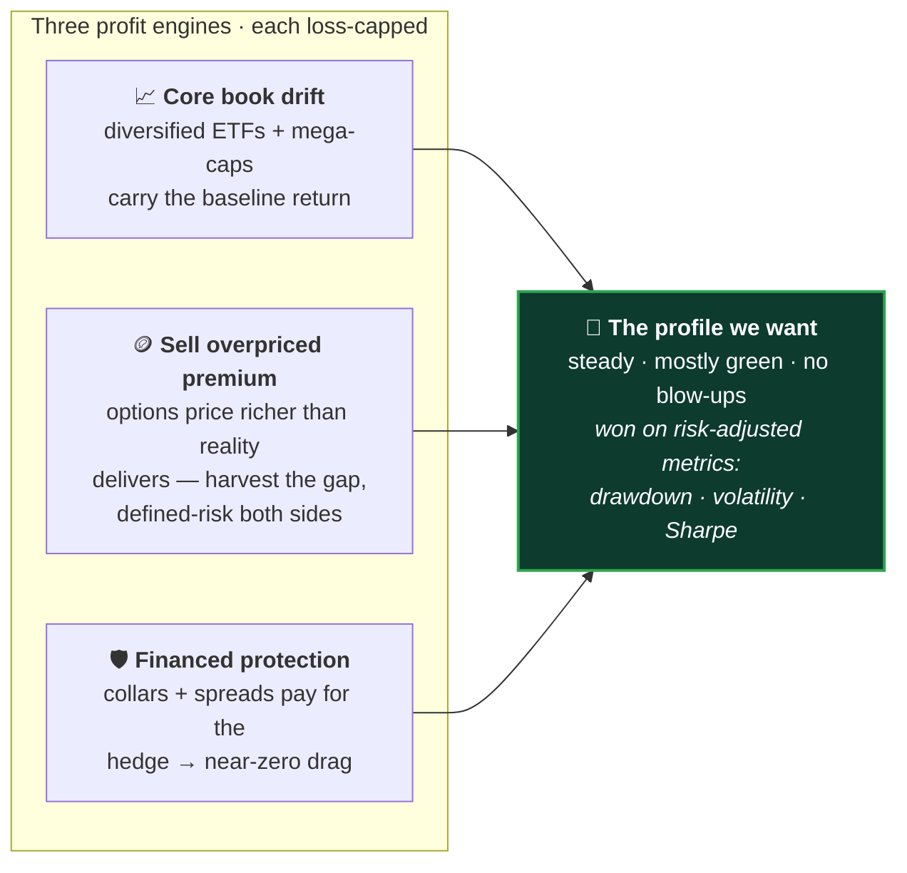

---

## 🏗️ System architecture

A clean split: **deterministic Python owns the math**, the **model owns the judgment**, and
a **fail-closed executor** owns the orders. Nothing crosses those lines.

```mermaid
flowchart LR
    subgraph DATA["📡 Data · read-only"]
        A1["Alpaca paper feed"]
        A2["Mock feed / fixtures<br/><i>runs fully offline</i>"]
    end

    subgraph CORE["🧮 Deterministic core · risk_engine/"]
        direction TB
        C1["<b>metrics</b><br/>vol · VaR · tails · beta"]
        C2["<b>blackscholes</b><br/>price · Δ Θ Γ vega"]
        C3["<b>scoring</b><br/>Risk Score → coverage"]
        C4["<b>engine + income</b><br/>overlay sizing"]
        C5["<b>limits</b><br/>hard risk caps"]
    end

    subgraph BRAIN["🧠 Harness + model · agent/dsh/"]
        direction TB
        B1["DSH heartbeat<br/><i>interval-driven</i>"]
        B2["model-native adapter<br/><i>2 forced tool calls</i>"]
        B3["decision bridge"]
        B4["🤖 Reasoning model<br/><b>GLM-5.3</b> via HF"]
    end

    subgraph EXEC["⚙️ Execution · paper, fail-closed"]
        E1["candidate gate"]
        E2["Alpaca orders<br/><i>resolves real contracts</i>"]
    end

    subgraph OBS["📒 Observability"]
        O1["decision ledger"]
        O2["self-grading"]
        O3["backtest replay"]
    end

    DATA --> CORE
    B1 --> B2
    B2 <--> B4
    B2 --> B3 --> CORE
    CORE --> E1 --> E2
    E2 --> OBS
    CORE --> O1
    O1 --> O2

    style CORE fill:#0b2545,stroke:#4d8bf0,color:#fff
    style BRAIN fill:#3a1c5e,stroke:#a06be0,color:#fff
    style EXEC fill:#5e3a1c,stroke:#e0a06b,color:#fff
```

**The model never does arithmetic and never invents an order.** It picks exactly one of a
set of pre-vetted, pre-sized candidates. Numbers measure; the model judges; the log remembers.

---

## 🔄 The decision loop

Every cycle the agent runs one loop — and the split between the two owners is the whole point.

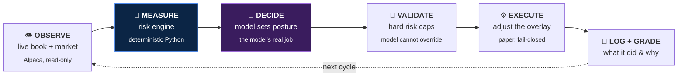

| Deterministic code owns — **the math** | The model owns — **the judgment** |
|---|---|
| Exposure, volatility, VaR, stress tests | *When* risk is worth hedging **right now** |
| How many contracts for a given coverage | *How much* to protect, given cost + regime |
| Whether protection is cheap today | *When* to release a hedge no longer needed |
| All order sizing and hard risk caps | Reading soft context the numbers miss, and explaining the move |

---

## 🔌 Per-cycle protocol (model ↔ deterministic core)

The harness exposes the model **exactly two tools** and forces their order. Order sizing,
strikes, and risk caps are computed deterministically and hidden behind the gate — the model
only ever *chooses*.

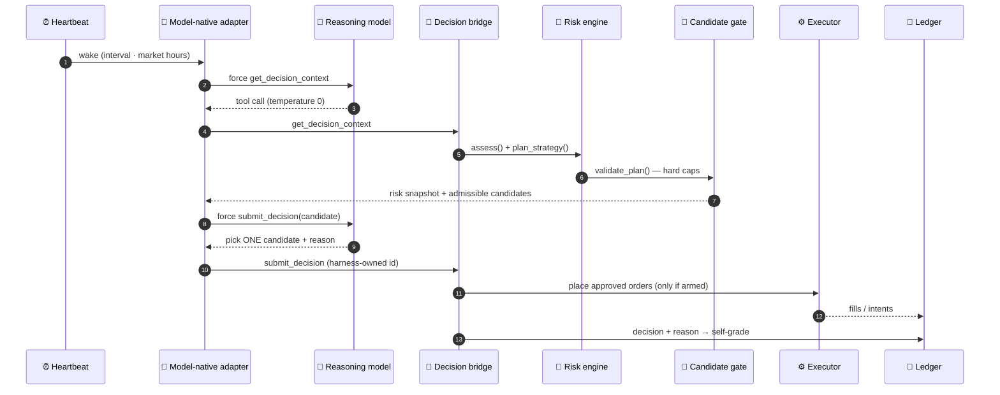

---

## 📊 What it measures

A compact risk snapshot every cycle — dozens of institutional-grade measures, all pure
functions, all unit-tested, all dependency-free:

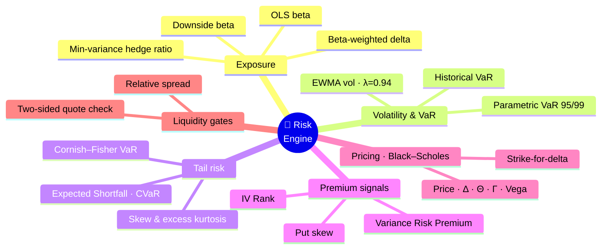

Those signals roll into a single **Risk Score (0–100)** that drives the hedge. The mapping is
an exact, transparent function — **calm ⇒ near-zero hedge (no drag); stress ⇒ step protection up:**


And the **inverse dial** governs premium selling — harvest hardest when options are richest
versus realized volatility (positive variance risk premium), damped to zero as the regime turns:

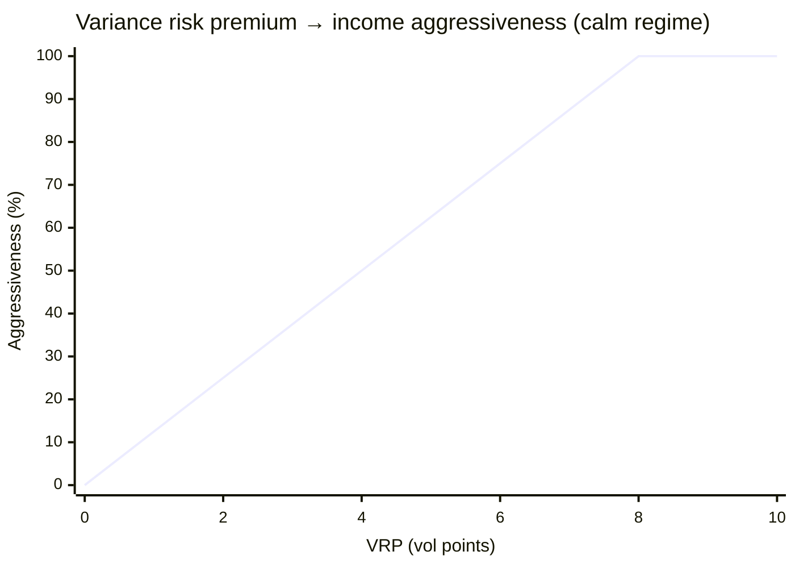

---

## 🎛️ Strategy postures

The two dials combine into one of four stances each cycle. The agent moves between them
automatically as regime and premium richness change:

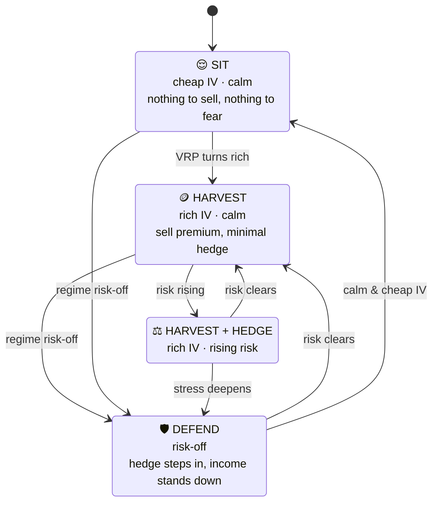

---

## 🛡️ How the hedge reshapes P&L

The point of the overlay: **cap the left tail while keeping the upside.** Below is the payoff
mechanism of the protective overlay — book alone vs. book + hedge across an adverse move.
*(Illustrative of the protective-put mechanism, not a historical return series.)*

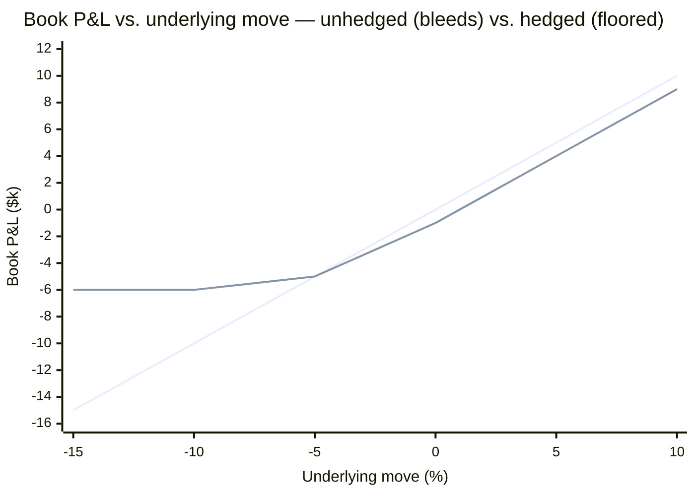

> The lower line is the naked book — a straight loss into a sell-off. The upper line is
> book + hedge: the left tail flattens (the put pays), the small gap at 0% is the financed
> premium, and the upside is preserved. **Defense you can watch, not a backtest you must trust.**

We also **replay the engine through real historical crashes** (`backtest/`) — showing the
unhedged vs. hedged equity curves so the cushion is visible over more than five live days.

---

## 🧺 The core book

Fixed **upfront** — the agent *protects* the book, it never picks it. Diversified across
market, size, and sector so no single name dominates the P&L, yet every holding stays highly
correlated to SPY so the **SPY put hedge actually covers the book** (low basis risk). ~80%
invested; the rest is a cash sleeve for premium + margin.

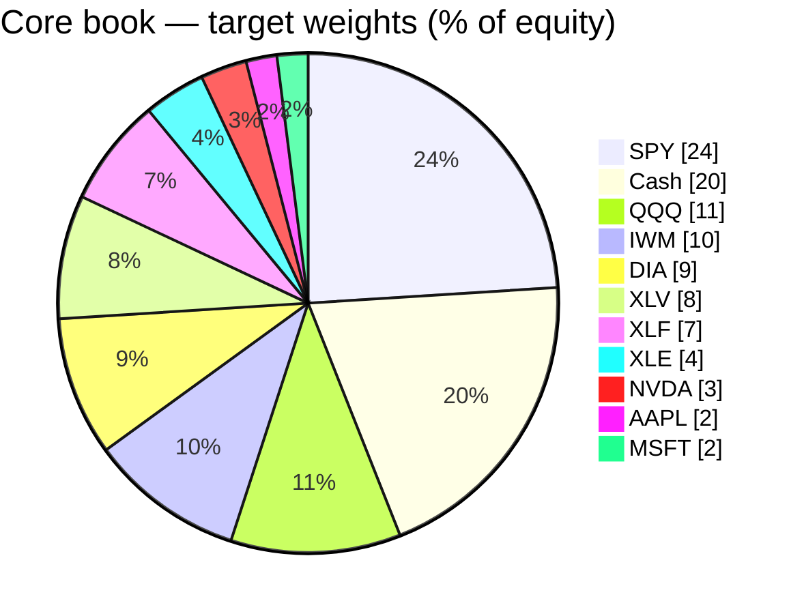

Weights (not hard-coded share counts) are the single source of truth, so the same definition
sizes correctly at any account value or price — see [`risk_engine/book.py`](risk_engine/book.py).

---

## 🚦 Hard risk caps (the model cannot override these)

Every downside is bounded by a deterministic gate that runs *after* the model decides.
Offending income is **scaled down, never silently dropped**, so the model only ever chooses
from a pre-validated, safe set — see [`risk_engine/limits.py`](risk_engine/limits.py).

| Guardrail | Cap | Behaviour when breached |
|---|---|---|
| 🩸 **Daily-loss halt** | −5% on the day | Stop opening new premium (keep the hedge on) |
| 📦 **Total option risk** | ≤ 30% of equity | Scale income down to fit |
| 🎯 **Per-underlying risk** | ≤ 15% of equity | Scale the offending symbol down |
| 🛡️ **Hedge premium / cycle** | ≤ 5% of equity | Flag (never auto-reduce protection) |

---

## 🤖 Model selection & qualification

The reasoning brain sits behind a single config seam so we can swap open models freely. We
don't take a vendor's word for it — every candidate runs a **30-call transport qualification**
(10 direct + 20 through the DSH harness) with a strict, forced two-tool schema. A candidate
that emits malformed tool calls, drifts schema, or times out is **disqualified**.

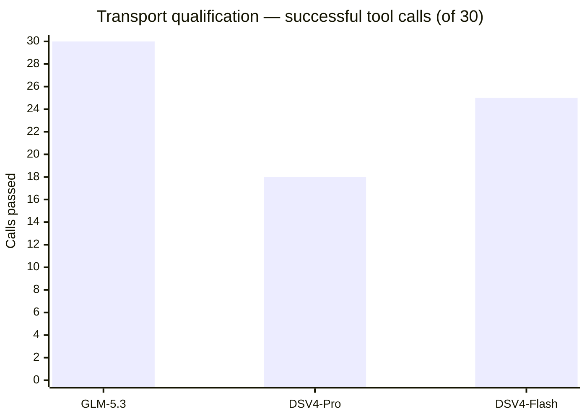

| Candidate | Verdict | Direct (10) | DSH (20) | Schema-invalid | Timeouts |
|---|---|---|---|---|---|
| **GLM-5.3** | ✅ **Passed** | 10/10 | 20/20 | 0 | 0 |
| DSV4-Pro | ❌ Failed | 0/10 | 18/20 | 12 | 0 |
| DSV4-Flash | ❌ Failed | 9/10 | 16/20 | 5 | 0 |

Only **GLM-5.3** is transport-stable across all 30 calls; both DeepSeek candidates fail on
native schema instability (not parse/timeout artifacts). Evidence is committed under
[`results/`](results/). The model-native adapter normalizes each provider's dialect (standard
tool-calls, GLM XML, DeepSeek DSML) back to one canonical call — no prompt demonstrations,
temperature 0, harness-owned decision ids.

---

## ☁️ Deployment: always-on heartbeat

Packaged as a durable **Modal** app — an always-on CPU container that owns the heartbeat and
exposes an HTTP liveness probe. **Paper-safe by construction: no Alpaca credential is mounted,
so this deployment physically cannot place a trade** until a separate, reviewed change arms it.

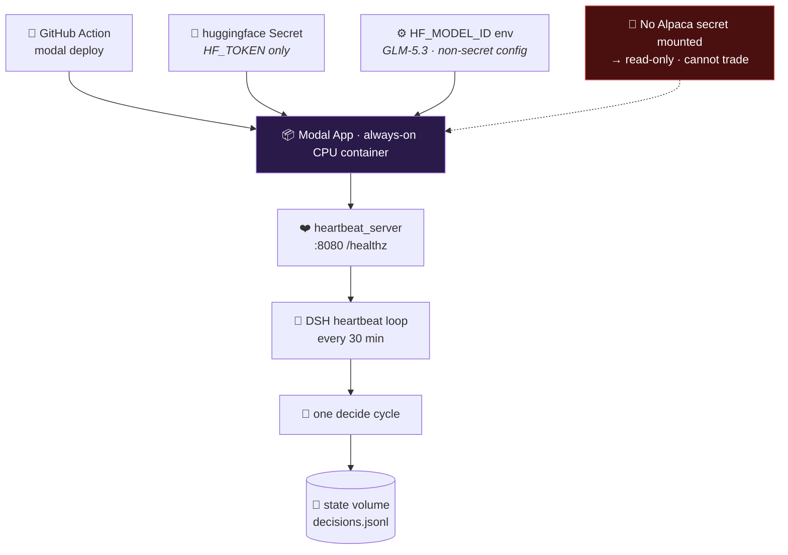

---

## 🗂️ Repository map

```
risk_engine/     Pure-Python options + portfolio math — the deterministic core
  ├─ metrics.py       vol · VaR · tails · beta · liquidity (all pure functions)
  ├─ blackscholes.py  price · delta · theta · gamma · vega · strike-for-delta
  ├─ scoring.py       Risk Score (0–100) → target coverage · income aggressiveness
  ├─ engine.py        assess() snapshot + plan_hedge / plan_strategy
  ├─ income.py        covered calls + iron condors (theta harvest)
  ├─ limits.py        hard risk caps (the gate)
  └─ book.py          fixed target-weight core book + rebalance math
agent/           The reasoning layer
  ├─ candidates.py    builds the pre-vetted candidate set
  ├─ gate.py          deterministic admissibility gate
  ├─ cli.py           context / submit entrypoints (the deterministic bridge)
  ├─ model_evaluation.py  candidate qualification protocol
  └─ dsh/             DSH harness · model-native adapter · heartbeat (Node)
feed/            Data sources — Alpaca (live) + mock (offline), one interface
harness/         Order translation + paper executor (fail-closed)
runtime/         Self-grading + the strategy API
backtest/        Historical crash replay — hedged vs. unhedged equity curves
deploy/          Modal always-on heartbeat + model-eval apps
results/         Committed model-qualification evidence
tests/           74 Python tests · agent/dsh/tests 20 Node tests
```

---

## ▶️ Run it

```bash
# 1. Seed the core book on the Alpaca paper account (dry-run first)
python scripts/seed_book.py            # show the plan
python scripts/seed_book.py --execute  # place the paper buy orders

# 2. Take one live decision cycle — read the book + market, size the posture
python -m agent.cli context --live
```

Run the always-on monitoring heartbeat through DSH (interval-driven, market-hours gated):

```bash
dsh --profile portfolio-agent --live --heartbeat "protect the book"
```

Credentials come from `.env` (`ALPACA_API_KEY` / `ALPACA_SECRET_KEY`, paper). **The whole
stack runs offline against a mock feed when no keys are set** — no account needed to develop.

---

## ✅ Testing

```bash
python -m unittest discover -s tests        # 74 Python tests
cd agent/dsh && npm test                    # 20 DSH / adapter tests
```

**94 tests, zero external services required.** The deterministic core is exercised end-to-end
— metrics, pricing, scoring, sizing, caps, the candidate gate, the model-native adapter, and
the paper-placement path — all offline.

---

## 🗺️ Roadmap

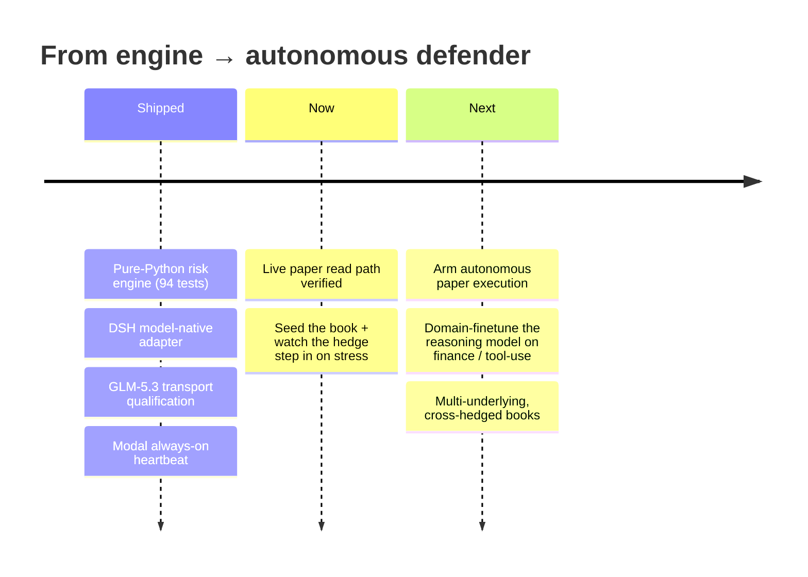

---

<div align="center">

**Team Liquidity Leak** · built for the Alpaca × lablab.ai Hackathon
Numbers measure. The model judges. The log remembers.

<sub>MIT licensed · paper-trading only · not investment advice</sub>

</div>
